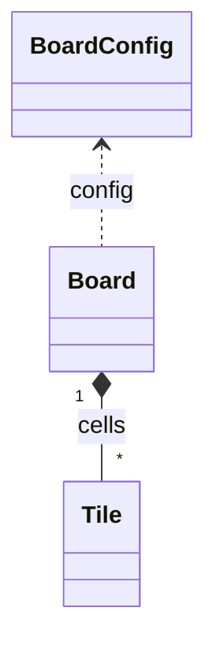

# Architecture

<!-- Overview of the project architecture -->

## Data Layer

Below diagram illustrates relationships between main data classes.

The `BoardGenerator` class uses `BoardConfig` to create a `Board` filled
with `Tile` instances. It ensures the generated board always has at least one
possible move by regenerating up to ten times if necessary.
