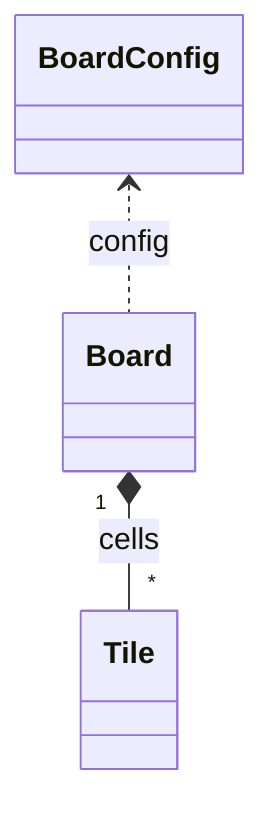
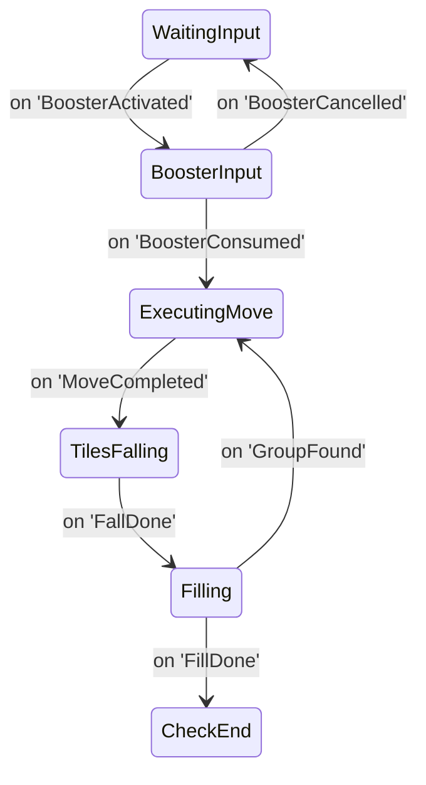

# Architecture

<!-- Overview of the project architecture -->

## Data Layer

Below diagram illustrates relationships between main data classes.

The `BoardGenerator` class uses `BoardConfig` to create a `Board` filled
with `Tile` instances. It ensures the generated board always has at least one
possible move by regenerating up to ten times if necessary.

## Game Loop

The finite state machine drives the core gameplay. User input is processed in
`WaitingInput` and, when a booster is activated, in the dedicated
`BoosterInput` state. The diagram below shows how booster related transitions
tie into the main loop.

After a move or booster action completes in `ExecutingMove` the machine
continues through tile falling and filling before returning to
`WaitingInput` or ending the game.

### Event flow

Components communicate via the global event bus. All event names are centralized in [`EventNames.ts`](assets/scripts/core/events/EventNames.ts).
The bus keeps an internal registry of subscribers and logs a warning when events fire without any listeners.

To aid troubleshooting, a `MoveSequenceLogger` listens to key move events (`GroupSelected`, `TilesRemoved`, `FallDone`, `FillStarted`, `FillDone`). It warns when `FillDone` is missing for more than 600 ms and prints a summary of how many tiles were removed or spawned. A small badge component subscribes to this logger and displays the latest step, turning red if such a mismatch occurs.
