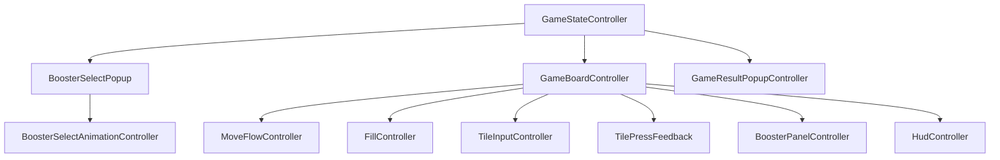
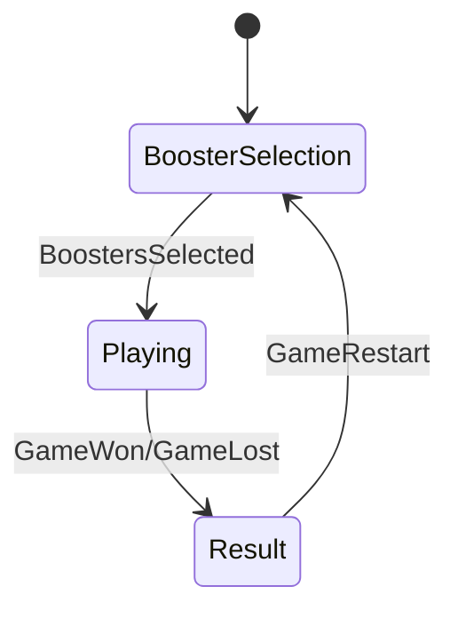

# Designer Guide

## `assets/` Structure
- **`scenes/`** – `.fire` scene files and their `.fire.meta` counterparts.
- **`prefabs/`** – `.prefab` assets next to matching `.prefab.meta` files.
- **`scripts/`** – `.ts` scripts with corresponding `.ts.meta` files.
- **`*.meta`** – must stay next to every file and folder, storing UUIDs and links. Never delete them.

## Controller Hierarchy and Game Start

### Game States

### Boot Sequence

1. **Scene start** – `GameStateController` enables `BoosterSelectPopup` and hides `GameBoard`.
2. **Booster selection** – `BoosterSelectPopup` with `BoosterSelectAnimationController` plays the intro and lets the player choose up to two boosters.
3. **Play pressed** – `BoosterSelectPopup` emits `BoostersSelected`.
4. **Game start** – `GameStateController` catches the event and switches to `GameBoard`, enabling the HUD and `BoosterPanelController`.
5. **Gameplay** – `GameBoardController` drives the board while nested controllers (`MoveFlowController`, `FillController`, `TileInputController`, `TilePressFeedback`) react to core events.
6. **Result** – on `GameWon/GameLost`, `GameResultPopupController` appears.
7. **Restart** – the Restart button emits `GameRestart`, and `GameStateController` returns to booster selection.

## Controllers

### GameStateController
Main scene controller.

- **Events:** `BoostersSelected`, `GameRestart`.
- **Links:** `boosterSelectPopup` – node for booster selection, `gameBoard` – root board node.
- **Responsibility:** toggles the `BoosterSelectPopup` and `GameBoard` screens.

### BoosterSelectPopup
Handles the booster selection UI.

- **Events:** emits `BoostersSelected`.
- **Links:** `boosterSlotGrid`, `boosterSlotPrefab`.
- **Responsibility:** creates slots from `BoosterRegistry`, stores choice in `BoosterSelectionService`, emits `BoostersSelected` on Play.

### BoosterSelectAnimationController
Animates `BoosterSelectPopup` elements frame by frame.

- **Links:** `gameNameLabel`, `selectBoosterLabel`, `boosterSelectBackground`, array `boosterSlots`, `playButton`.
- **Responsibility:** defines the appearance sequence for title, background, slots and Play button; delays are adjustable in the inspector.

### BoosterPanelController
Booster panel in the HUD.

- **Events:** `BoosterConsumed`, `BoosterCancelled`, `BoostersSelected`, `GameRestart`.
- **Links:** `boosterList`, `boosterSlotPrefab`, `boosterLabel`.
- **Responsibility:** creates slots for active boosters, highlights the selected one and updates charge counters.

### GameBoardController
Central controller of the game board.

- **Links:** `tileNodePrefab`, `tilesLayer`.
- **Responsibility:** generates the board, spawns tiles, creates child `MoveFlowController` and `FillController`, stores the `TileView` matrix.

### MoveFlowController
Move animation handler.

- **Events:** `RemoveStarted`, `FallDone`, `FillDone`, `SuperTileCreated`.
- **Responsibility:** plays tile removal and falling animations, creates visual super tiles.

### FillController
Creates new tiles.

- **Events:** `FillStarted`, `FillDone`.
- **Links:** `tileNodePrefab`, `tilesLayer` (set by `GameBoardController`).
- **Responsibility:** spawns and applies visual tiles for new board elements.

### TileInputController
Player input.

- **Events:** emits `GroupSelected`, `InvalidTap`.
- **Links:** `tilesLayer`.
- **Responsibility:** converts touch coordinates to row/column and checks tile interactivity.

### TilePressFeedback
Visual response to taps.

- **Events:** `TilePressed`.
- **Responsibility:** plays the `pressFeedback` animation on the selected `TileView`.

### HudController
Gameplay HUD.

- **Events:** `TurnsInit`, `TurnUsed`, `TurnEnded`, `StateChanged`, emits `GamePaused`.
- **Links:** `lblScore`, `lblMoves`, `lblState`, `btnPause` (found automatically).
- **Responsibility:** shows score and moves, emits `GamePaused` when the pause button is pressed, displays current FSM state.

### GameResultPopupController
End game popup.

- **Events:** listens to `GameWon`, `GameLost`, emits `GameRestart`.
- **Links:** `resultLine`, `lblTitle`, `lblFinalScore`, `btnRestart`.
- **Responsibility:** animates the result and Restart button, emits `GameRestart` after a click.

### MoveSequenceBadge
Debug badge.

- **Events:** listens to `MoveSequenceLogger` status.
- **Links:** `label` (optional, can be found automatically).
- **Responsibility:** shows the last move index and highlights unsynchronized state.

## Attaching Controllers
1. Open the required scene.
2. Select a node in the hierarchy and click **Add Component → Scripts → controllers**.
3. Choose a controller from `ui/controllers/*`.
4. In the inspector, assign node/resource references and save the scene.

## Using Configuration
- Config file: `config/gameConfig.json`.
- In the inspector, drag `gameConfig` into `JsonAsset` properties.
- In code: `const cfg = await loadGameConfigAsync();` from `ConfigLoader`.

## Pre-build Checklist
- [ ] **SafeArea** – the Canvas has `SafeAreaAdjuster`, elements avoid cutouts.
- [ ] **HUD** – panels are anchored to screen edges and do not cover the board.
- [ ] **Booster limits** – values in `boosterLimits` from `gameConfig.json` match the requirement.
