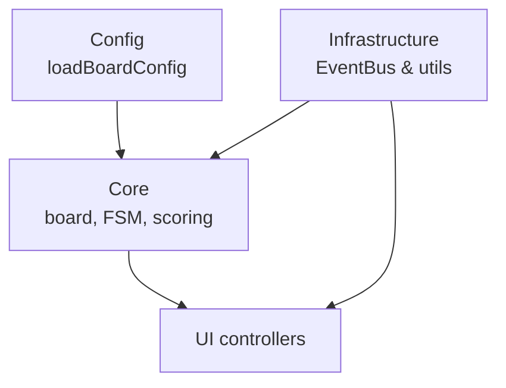
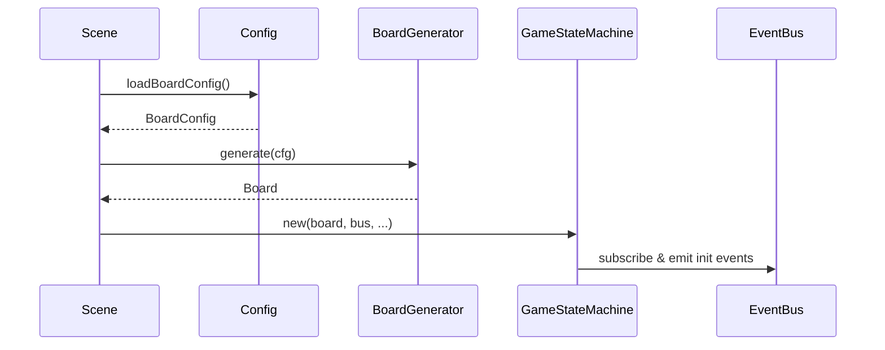
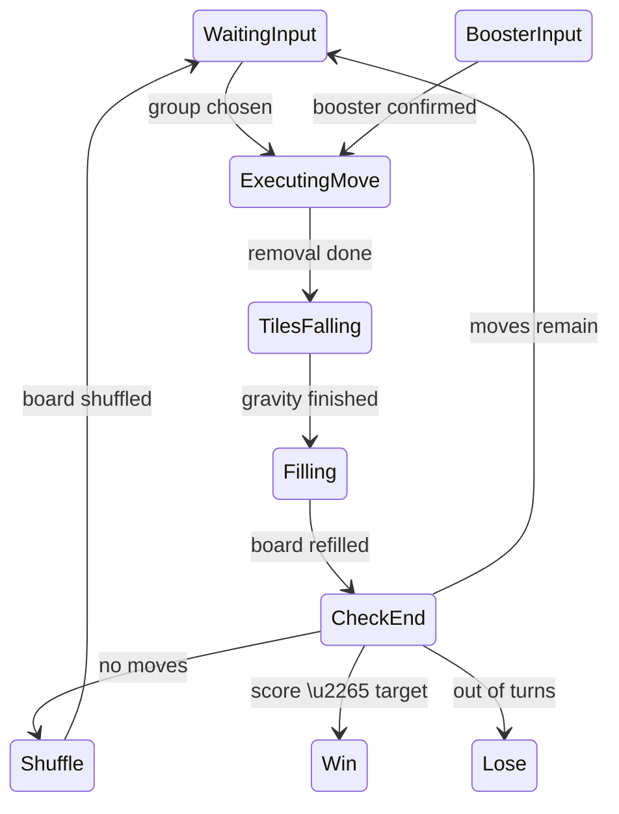
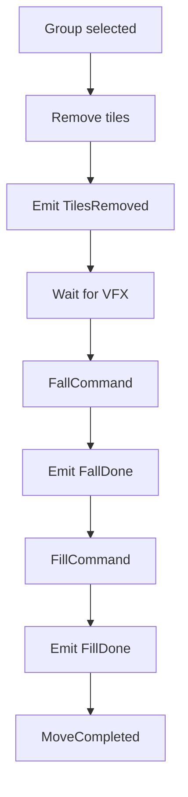

# Developer Guide

## Module architecture

### `assets/scripts/core`
The **core** module contains the gameplay algorithms and orchestrates a session.
Key components:

- **BoardGenerator** – creates a fresh board using a seeded RNG and repeats generation until at least one horizontal or vertical pair exists. Dead‑start boards are retried up to ten times.
- **BoardSolver** – analyses the board. `findGroup` performs a flood‑fill with an explicit stack to avoid recursion limits, while `expandBySupers` uses a queue to trigger chain reactions from super tiles.
- **MoveExecutor** – applies the Command pattern. It sequentially runs `Remove`, `Fall` and `Fill` commands, waiting for events after each step. After tiles vanish and visual effects complete, gravity runs and finally empty slots are filled.
- **GameStateMachine** – finite state machine driving the loop. It listens on the global EventBus and transitions through `WaitingInput → ExecutingMove → TilesFalling → Filling → CheckEnd`. End evaluation may shuffle the board with a Fisher–Yates algorithm or emit win/lose events.
- **ScoreStrategyQuadratic** – awards `(size‑1)^2 * multiplier` points so larger groups grow quadratically. `TurnManager` decreases remaining moves and raises `OutOfTurns` when none remain.

### `assets/scripts/infrastructure`
Infrastructure provides low‑level utilities. The central piece is `InfrastructureEventBus` – a wrapper over `cc.EventTarget` that keeps a registry of listeners. It offers `on`, `off`, `once`, `emit` and logs a warning when events fire without observers, helping catch mis‑spelled event names.

### `assets/scripts/config`
`ConfigLoader` supplies runtime configuration. It caches values on first access, can load asynchronously from a JSON asset and persists booster limits to `localStorage`. Helper functions like `loadBoardConfig()` and `loadBoosterLimits()` expose the data to both core logic and UI.

## Data flow and game loading
The scene boot process is a simple pipeline:

`GameScene.start()` loads board parameters, constructs the board, sets up the solver, move executor and score strategy, then starts the state machine. The EventBus immediately publishes turn and score counters so HUD widgets can render initial values.

## Game loop
The finite state machine controls gameplay:

While in `WaitingInput` the player taps tiles. `ExecutingMove` runs commands and when all events settle the machine evaluates win, lose or shuffle conditions before returning to input.

## Move execution flow

Each command fires events consumed by UI controllers. The executor waits for the corresponding completion event before proceeding, ensuring animations finish in order.

## Design patterns

- **EventBus** – the `InfrastructureEventBus` instance acts as a global event aggregator so loosely coupled systems communicate without direct references.
- **GameStateMachine** – encapsulates gameplay logic as explicit states and transitions, improving testability and debuggability.
- **Command pattern** – discrete board changes (`RemoveCommand`, `FallCommand`, `FillCommand`) implement a common interface and are sequenced by `MoveExecutor`.
- **Score strategies** – scoring rules implement `ScoreStrategy`, allowing alternative algorithms to be plugged in while preserving the core loop.

## Style and project structure

- Linting rules are defined in [`.eslintrc.cjs`](../.eslintrc.cjs); run `npm run lint` to check formatting.
- Source code is grouped under `assets/scripts/` by responsibility (`core`, `infrastructure`, `config`, `ui`).
- Tests reside in `__tests__/` mirroring the source tree and should accompany new features.

## Testing

Execute unit tests with `npm test`. Place new test files inside the relevant folder under `__tests__/`.
